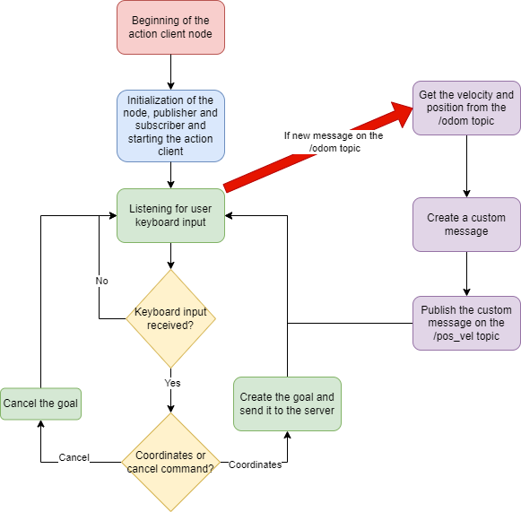

# RT_assignment2

Farah Yassin 4801788

## Description

In this assignment, it's requested to implement, in **ROS**, three nodes for controlling a mobile robot in a 3D simulation environment called *Gazebo*. The **first node** should allow the user to set the desired position of the robot inside of the arena or to stop the robot. The **second node** is a service and, when called, should print the number of positions reached and how many times the robot has been stopped. The **third node** should print the distance of the robot from the desired position and its average speed.

<figure>

<figcaption align = "center"><b>Simulation arena</b></figcaption>
</figure>
<br/><br/>

## Nodes

Inside the module, you'll find six nodes:

- `bug_as.py` is the action server node that gets the desired position from the client and calls the needed services to bring the robot to the desired position, setting the position as a ROS parameter
- `client.py` is the action client node that allows the user to set the desired position or to cancel the desired position and it publishes the robot position and velocity as a custom message on the /*pos_vel* topic, relying on the values of the /*odom* topic. The functioning of this node is described in the following flowchart:
  
<figure>

<figcaption align = "center"><b>Client functioning flowchart</b></figcaption>
</figure>
<br/><br/><br/>

- `info_node.py` is the node that prints the distance of the robot from the desired position and its average speed, getting them from the */pos_vel* topic as a custom message. The information is printed with the frequency set as a ROS parameter inside of the launch file
- `go_to_point_service.py` is the service node that, when called, makes the robot move toward the desired position, retrieved from the ROS parameter
- `wall_follow_service.py` is the service node that, when called, makes the robot move around an obstacle (a wall, an object...)
- `goals_service.py` is the service node that, when called, prints the number of times a goal has been reached and the number of times a goal has been canceled

For more information, take a look at the [documentation](https://yassinfrh.github.io/RT_assignment2/).

## Install and run

First of all, you need to run the master by typing:

    roscore &

To install the module, you need to go inside the `src` folder of your ROS workspace and run the following command:

    git clone https://github.com/yassinfrh/RT_assignment2

and from the root directory of your ROS workspace run the command:

    catkin_make

To run the program, you need to have installed in your system the program **xterm**. To install it, run:

    sudo apt-get install xterm

Finally, to run the code, type the following command:

    roslaunch assignment_2_2022 assignment1.launch

<figure>

<figcaption align = "center"><b>Program running</b></figcaption>
</figure>
<br/><br/><br/>

After launching the program, four windows will pop up:

- **Rviz** is a tool for ROS visualization and it's used for debugging and adding additional functionalities to the robot, so you can ignore it
- **Gazebo** is the 3D visualization environment in which you'll see the arena and the robot moving around it
- **info_node.py** is the window in which the information about the robot is printed
- **client.py** is the window in which the user can input the desired position or cancel it

To get the information about the number of goals reached and canceled, open a command window and write

    rosservice call /goals

<br/><br/>

The frequency with which the information is printed in the info_node.py window can be set in the launch file `assignment1.launch` inside of the `launch` directory. To do so, modify the value in the following line:

```xml
    <!--Parameter to set the frequency the info is printed with-->
    <param name="publish_frequency" type="double" value="1.0" />
```

and relaunch the program.

## Possible improvements

The program has some flaws and in a future update, it would be possible to fix them and improve the code. The problems are:

- if the desired position is exactly where an obstacle is, the robot will bump into the obstacle and sometimes flip over, trying to reach it. To avoid this behavior, the robot, when approaching the position, could recognize that the position is unreachable, stop in front of the obstacle and inform the user.
- if the robot encounters an obstacle while moving to the desired position, it will go around it always in a clockwise way, sometimes getting further from the goal. To fix this, the robot could choose in which way it should go around the obstacle by choosing the one that will make him go closer to the desired position.
- it's not clear where the desired position is sometimes, so it would be nice to display a marker on the arena representing the goal.
